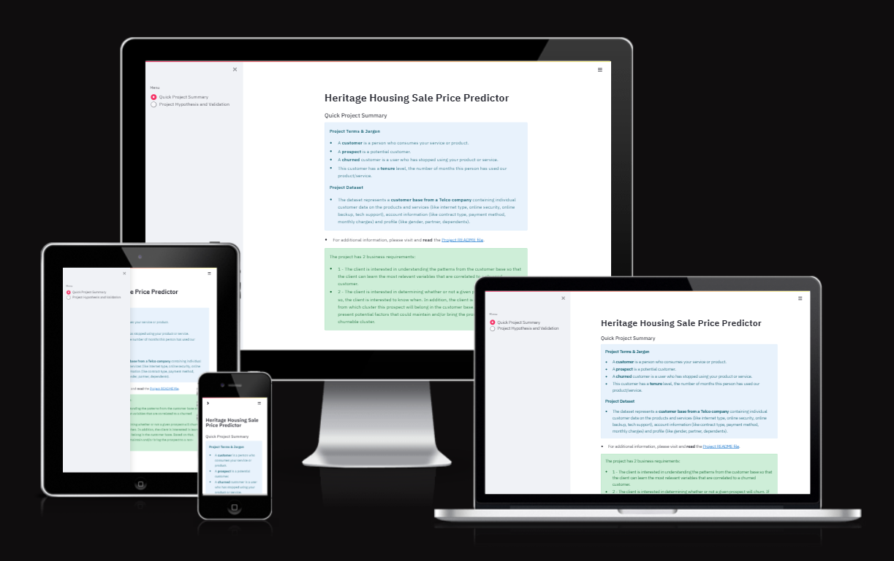

# Heritage Housing Issues

**Data Analysis and Predictive Modelling Study**

**Developed by: Ulrike Riemenschneider**

**Live Site:** [Live webpage](https://heritage-housing-uriem-381968c86628.herokuapp.com)

**Link to Repository:** [Repository](https://github.com/URiem/heritage-housing-PP5)

## Table of Content

- [Heritage Housing Issues](#heritage-housing-issues)
  - [Table of Content](#table-of-content)
  - [Introduction](#introduction)
  - [CRISP-DM Workflow](#crisp-dm-workflow)
  - [Business Requirements](#business-requirements)
  - [Dataset Content](#dataset-content)
  - [Hypothesis and how to validate?](#hypothesis-and-how-to-validate)
  - [Mapping the business requirements to the Data Visualisations and ML tasks](#mapping-the-business-requirements-to-the-data-visualisations-and-ml-tasks)
  - [ML Business Case](#ml-business-case)
    - [Predict Sale Price](#predict-sale-price)
  - [Dashboard Design](#dashboard-design)
    - [Page 1: Project Summary](#page-1-project-summary)
    - [Page 2: Analysis of Sale Price](#page-2-analysis-of-sale-price)
    - [Page 3: Sale Price Prediction](#page-3-sale-price-prediction)
    - [Page 4: Hypothesis and Validation](#page-4-hypothesis-and-validation)
    - [Page 5: Machine Learning Model](#page-5-machine-learning-model)
  - [Unfixed Bugs](#unfixed-bugs)
  - [Deployment](#deployment)
    - [Heroku](#heroku)
  - [Technologies](#technologies)
    - [Development and Deployment](#development-and-deployment)
    - [Main Data Analysis and Machine Learning Libraries](#main-data-analysis-and-machine-learning-libraries)
  - [Credits](#credits)
    - [Sources of code](#sources-of-code)
    - [Media](#media)
  - [Acknowledgements](#acknowledgements)

## Introduction

This Machine Learning Project was developed as the fifth portfolio project during the Code Insititute's Diploma in Full Stack Development. It covers the Predictive Analytics specialization.

The Maching Learning and Data Analysis toolkit is applied to a real estate data set and developed with the specific purpose to allow a user to predict the sale value of a property based on certain features of the home. It also allows the user to see how certain features of a home correlate with the sale price of the home.

My personal motivation for choosing this project, is that I myself inherited two properties in a small town in the US in 2011 and subsequently became licensed and worked as a real estate agent for several years in order to gain experience in the real estate market and ultimately sell the properties I had inherited.

## CRISP-DM Workflow

The project was developed using the Cross Industry Standard Process for Data Mining. This follows several iterations over well defined steps:

1. Business Understanding - This incorporates an extensive discussion with the client and their expectations as well as the development of acceptance criteria. These are layed out in the [Business Requirements](#business-requirements) below.
2. Data Understanding - The data needed to achieve the business requirements must be identified and understood. Are the data available to answer the business requirements? An initial statistical analysis helps to determine whether the data available are adequate to answer the business requirements. This task is carried out in the Data Cleaning Notebook.
3. Data Preparation - Clean and impute data, carry out feature engineering, such as transformations or scaling, reformat data if needed. This step is very important to ensure the most effective and accurate modelling outcome. This is carried out in the Data Cleaning and Feature Engineering Notebooks.
4. Modelling - Determine the model algorithms to be used. Split the data into train and test sets. Use train sets to validate various algorithms and tune them using a hyperparamter search. This is carried out in the ModelEvalRegression_v1 Notebook.
5. Evaluation - Use the test set to evaluate the model performance. Match these with the business acceptance criteria.  This is carried out in the ModelEvalRegression_v1 and ModelEvalRegression_v2 Notebooks.
6. Deployment - Develop the streamlit app that will satisfy the business requirements determined in collaboration with the client and deploy the app online. The app is deployed in Heroku and the process is described in the [Deployment](#deployment) section below.

These steps can be matched up nicely to 6 Epics in the Agile development process. As we move along the pipeline of the development process we may flow back and forth between stages/epics of the development process as we learn new insight and have to revisit previous step in order to refine the development. While ultimately moving towards the final delivery of a product that satisfies the users/clients requirements.

## Business Requirements

A client who has received an inheritance from a deceased great-grandfather located in Ames, Iowa, has requested help in maximising the sales price for the inherited properties.

The client has an excellent understanding of property prices in her own state and residential area, but she fears that basing her estimates for property worth on her current knowledge might lead to inaccurate appraisals. What makes a house desirable and valuable where she comes from might not be the same in Ames, Iowa. She found a public dataset with house prices for Ames, Iowa, and has provided it for this project.

The client is interested in the following outcomes:

1. Discovering how the house attributes correlate with the sale price and which attributes most affect the sale price. Therefore, the client expects data visualisations of the correlated variables against the sale price for illustration.
  
2. Predicting the house sale price from her four inherited houses and any other house in Ames, Iowa, based on the most important features of the homes. The predictive model should aim to acchieve an R2 value of 0.8 or higher.

3. Delivery of the final product in the form of a deployed app that is easily accessible online and userfriendly.  

These requirements can also be viewed as the user stories of the client/end user.

1. As an end user, I want to be able to discover how features of a home correlate with the sale price, so that I can gain insight into the importance of a homes features in determining the sale price.
2. As an end user, I want to be able to determine the likely sale price of a home based on certain features, so that I can gain insight into the likely values of a given home in the area.
3. As an end user, I want to be able to access the required information easily online, so that I can find relevant information any time in a user friendly fashion.

## Dataset Content

- The dataset is sourced from [Kaggle](https://www.kaggle.com/codeinstitute/housing-prices-data). The business requirements are based on a fictitious, but realistic, user story described above. Predictive analytics can be applied here in a real world scenario.

- The dataset has almost 1.5 thousand rows and represents housing records from Ames, Iowa, indicating house profile (Floor Area, Basement, Garage, Kitchen, Lot, Porch, Wood Deck, Year Built, etc.) and its respective sale price for houses built between 1872 and 2010.

|Variable|Meaning|Units|
|:----|:----|:----|
|1stFlrSF|First Floor square feet|334 - 4692|
|2ndFlrSF|Second-floor square feet|0 - 2065|
|BedroomAbvGr|Bedrooms above grade (does NOT include basement bedrooms)|0 - 8|
|BsmtExposure|Refers to walkout or garden level walls|Gd: Good Exposure; Av: Average Exposure; Mn: Minimum Exposure; No: No Exposure; None: No Basement|
|BsmtFinType1|Rating of basement finished area|GLQ: Good Living Quarters; ALQ: Average Living Quarters; BLQ: Below Average Living Quarters; Rec: Average Rec Room; LwQ: Low Quality; Unf: Unfinshed; None: No Basement|
|BsmtFinSF1|Type 1 finished square feet|0 - 5644|
|BsmtUnfSF|Unfinished square feet of basement area|0 - 2336|
|TotalBsmtSF|Total square feet of basement area|0 - 6110|
|GarageArea|Size of garage in square feet|0 - 1418|
|GarageFinish|Interior finish of the garage|Fin: Finished; RFn: Rough Finished; Unf: Unfinished; None: No Garage|
|GarageYrBlt|Year garage was built|1900 - 2010|
|GrLivArea|Above grade (ground) living area square feet|334 - 5642|
|KitchenQual|Kitchen quality|Ex: Excellent; Gd: Good; TA: Typical/Average; Fa: Fair; Po: Poor|
|LotArea| Lot size in square feet|1300 - 215245|
|LotFrontage| Linear feet of street connected to property|21 - 313|
|MasVnrArea|Masonry veneer area in square feet|0 - 1600|
|EnclosedPorch|Enclosed porch area in square feet|0 - 286|
|OpenPorchSF|Open porch area in square feet|0 - 547|
|OverallCond|Rates the overall condition of the house|10: Very Excellent; 9: Excellent; 8: Very Good; 7: Good; 6: Above Average; 5: Average; 4: Below Average; 3: Fair; 2: Poor; 1: Very Poor|
|OverallQual|Rates the overall material and finish of the house|10: Very Excellent; 9: Excellent; 8: Very Good; 7: Good; 6: Above Average; 5: Average; 4: Below Average; 3: Fair; 2: Poor; 1: Very Poor|
|WoodDeckSF|Wood deck area in square feet|0 - 736|
|YearBuilt|Original construction date|1872 - 2010|
|YearRemodAdd|Remodel date (same as construction date if no remodelling or additions)|1950 - 2010|
|SalePrice|Sale Price|34900 - 755000|

## Hypothesis and how to validate?

In order to fullfill the business requirements and in discussion with the client, the following hypotheses have been developed:

1. We hypothesize that a property's sale price correlates strongly with a subset of the extensive features in the dataset. We aim to validate this using a correlation study of the dataset.
2. We hypothesize that the correlation is strongest with common features of a home, such as total square footage, overall condition and overall quality. We aim to validate this using a correlation study.
3. We hypothesize that we are able to predict a sale price with an R2 value of at least 0.8. We propose to validate this by developing a predictive model, optimizing it using data modelling tools and evaluating it based on the required criteria.

## Mapping the business requirements to the Data Visualisations and ML tasks

- Business Requirement 1: Data Visualization and Correlation Study.
  - We will inspect the data contained in the data set as it relates to the property sale prices in Ames, Iowa.
  - We will conduct a correlation study (Pearson and Spearman) to understand better how the variables are correlated to the sale price.
  - We will plot the most important and relevant data against the sale price to visualize the insights.

- Business Requirement 2: Regression and Data Analysis
  - We want to predict the sale price of homes in Ames, Iowa. For this purpose we will build a regression model with the sale price as the target value.
  - We will carry out optimization and evaluation steps in order to acchieve an R2 value of 0.8 or higher.

- Business Requirement 3: Online App and Deployement
  - We will build an app using streamlit that displays all the desired data analysis and visualization as well as a feature that will allow the client to predict the sale prices for her and any other property in Ames, Iowa.
  - We will deploy the app using Heroku.

## ML Business Case

### Predict Sale Price

- We want an ML model to predict sale price, in dollars, for a home in Ames, Iowa. The target variable is a continuous number. We firstly consider a regression model, which is supervised and uni-dimensional.
- Our ideal outcome is to provide a client with the ability to reliably predict the sale price of any home in Ames, Iowa, and more specifically the inherited properties the client is particularly concerned with.
- The model success metrics are:
  - At least 0.8 for R2 score, on train and test set.
  - The model is considered a failure if: after 12 months of usage, the model predictions are 50% off more than 30% of the time, and/or the R2 score is less than 0.8.
- The output is defined as a continuous value of sale price in dollars. Private parties/home owners/clients can access the app online and input data for their homes. The app can also be useful for real estate agents who want to give a quick estimate of saleprice to a prospective client, they can input the data on the fly while in live communication with a prospective client.
- The training data come from a public data set, which contains approx. 1500 property sales records. It contains one target features: sale price, and all other variables (23 of them) are considered features.

## Dashboard Design

The project will be built using a Streamlit dashboard. The completed dashboard will satisfy the third Business Requrirement. It will contain the following pages:

### Page 1: Project Summary

This page will incude:

- Project terms and jargon.
- Description of the data set.
- Statement of business requirements.

### Page 2: Analysis of Sale Price

This page will include checkboxes so the client has the ability to display the following visual guides to the data features:

- Correlation between various features and the sale price.
- Spearman and Pearson correlations.
- Predictive Power Score analysis.

This will satisfy the first Business Requrirement.

### Page 3: Sale Price Prediction

This page will include:

- Input feature of property attributes to produce a prediction on the sale price.
- Display of the predicted sale price.
- Predict the sale prices of the clients specific data in relation to her inherited properties.

This will satisfy the second Business Requirement.

### Page 4: Hypothesis and Validation

This page will include:

- A list of the project's hypothesis and how they were validated.

### Page 5: Machine Learning Model

This page will include

- Information on the ML pipeline used to train the model.
- Demonstration of feature importance.
- Review of the pipeline performance.
- Considerations and conclusions after pipeline training.

## Unfixed Bugs

- You will need to mention unfixed bugs and why they were not fixed. This section should include shortcomings of the frameworks or technologies used. Although time can be a big variable to consider, paucity of time and difficulty understanding implementation is not valid reason to leave bugs unfixed.

## Deployment

### Heroku

- The App live link is: <https://heritage-housing-uriem-381968c86628.herokuapp.com>
- Set the runtime.txt Python version to a [Heroku-20](https://devcenter.heroku.com/articles/python-support#supported-runtimes) stack currently supported version.
- The project was deployed to Heroku using the following steps.

1. Log in to Heroku and create an App
2. At the Deploy tab, select GitHub as the deployment method.
3. Select your repository name and click Search. Once it is found, click Connect.
4. Select the branch you want to deploy, then click Deploy Branch.
5. The deployment process should happen smoothly if all deployment files are fully functional. Click the button Open App on the top of the page to access your App.
6. If the slug size is too large then add large files not required for the app to the .slugignore file.

## Technologies

This section contains information on resources and technologies used to complete this project.

### Development and Deployment

- GitHub was used to create the project repository, story project files and record commits.
- Code Anywhere was used as the development environment.
- Jupyter Notebooks were used to analyse and engineer the data, and develop and evaluate the model pipeline.
  - In the terminal type `jupyter notebook --NotebookApp.token='' --NotebookApp.password=''` to start the jupyter server.
- Heroku was used to deploy the project.
- Kaggle was used to access the dataset.
- Streamlit was used to develop the online app interface.

### Main Data Analysis and Machine Learning Libraries

- Numpy was used for mathematical operations for examples determining means, modes, and standard deviations.
- Pandas was used for reading and writing data files, inspecting, creating and manipulating series and dataframes.
- ydata_profiling was used to create an extensive Profile Report of the dataset.
- PPScore was used to determine the predictive power score of the data features.
- MatPlotLib and Seaborn were used for constructing plots to visualize the data analysis, specifically the heatmaps, correlation plots and historgram of feature importance.
- Feature Engine was used for various data cleaning and preparation tasks:
  - Dropping Features, and Imputation of missing variables.
  - Ordinal Encoding, Numerical Transformations, Assessment of outliers, and Smart Correlation Assessment of variables.
- SciKit Learn was used for many machine learning tasks:
  - splitting train and test sets.
  - feature processing and selection.
  - gridsearch to determine the optimal regression model.
  - gridsearch to determine the optimal hyperparameters.
  - evaluation  of the model using r2_score.
  - Principal Component Analysis and evaluation.
- XGBoost for the XGBoostRegressor algorithm.

## Credits

### Sources of code

- The CI Churnometer Walkthrough Project and the CI course content was used to source various functions and classes in the development process, such as: HyperparameterOptimizationSearch, Feature Importance analysis, evaluation of train and test sets, PPS and Correlation Analysis and plots, Missing Data Evaluation, Data Cleaning Effect, etc.
- The CI Churnometer Walkthrough Project was also the source of the Steamlit pages where were then adapted to the app deployed in this project.
- More generally, The walkthrough project provided a guide for the general layout and flow of the project.

### Media

- The image of main street Ames is from [Wikipedia](https://commons.wikimedia.org/wiki/File:Ames_Iowa_Main_Street_%28bannerportada_esvoy%29.jpg)

- The images of Iowa State University was taken from [Niche.com](https://www.niche.com/colleges/iowa-state-university/)

## Acknowledgements

Many thanks and appreciation go to the following sources and people:

- Several past projects provided valuable additional information on how to complete a successful project:
  - Heritage Housing Issues project by T. Hullis [Link](https://github.com/t-hullis/milestone-project-heritage-housing-issues)
  - Exam Score Analysisy by Adam Boley [Link](https://github.com/AdamBoley/Exam-Scores-Analysis)
  - Heritage Housing Issues project by Farid Benachenhou [Link](https://github.com/faridjos/milestone-project-heritage-housing-issues)
- The Slack community has, as always, been invaluable in answering questions. For this project a particular thank you to Niel McEwen. As the moderator of the Predictive Analytics PP5 Slack channel he was the main person to help resolve several technical issues.
- My mentor Precious Ijege provided great feedback on how to improve the project in our mentor meetings.
- StackOverflow helped resolve several issues through out the project.
- As always a big thank you to my husband, Matthew, for his unwavering support!
